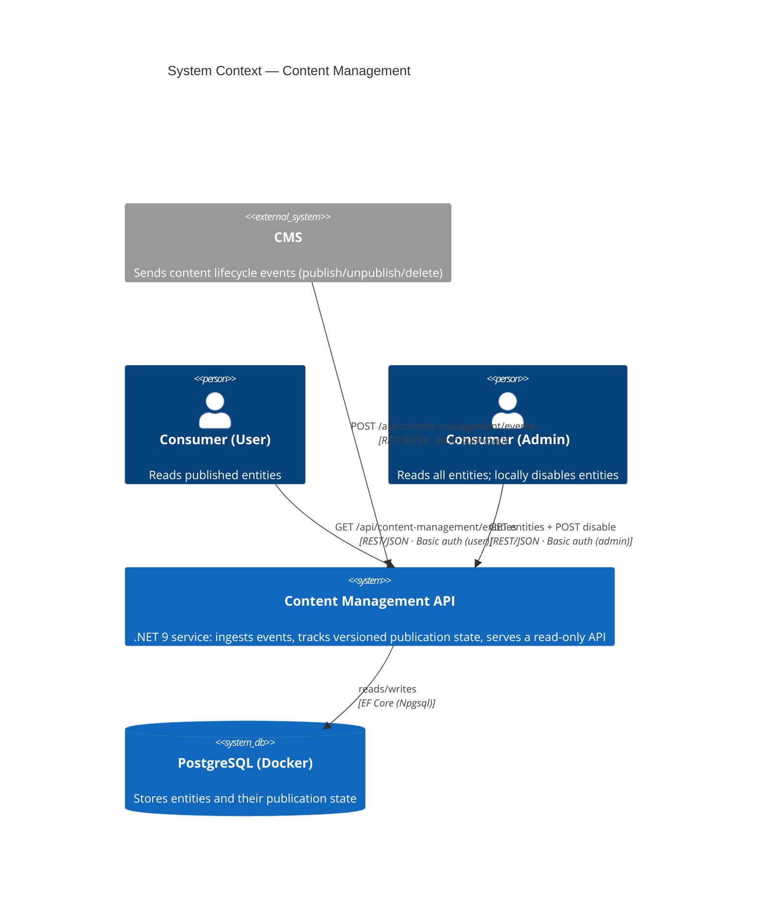

# System Context

The service has two independent Basic-auth boundaries: the CMS organization (webhook)
and API consumers (users vs. admin). Consumers are read-only; the CMS is the source
of truth.
