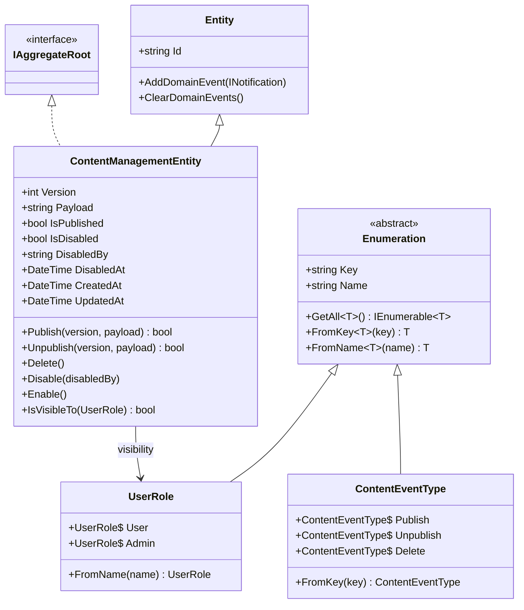

# Domain Aggregates

- `ContentManagementEntity` is the single aggregate root.
- `Version` tracks the **latest data version**; `IsPublished` tracks the
  **publication state** (they are distinct — see the unpublish corner case).
- `IsDisabled`/`DisabledBy`/`DisabledAt` are the **local admin override** (never
  affects CMS state) and carry the acting admin for extensibility.
- `IsVisibleTo(UserRole)`: `User` → `IsPublished && !IsDisabled`; `Admin` → always.
- No version history is stored — only the latest version is tracked.
- `UserRole` and `ContentEventType` are strongly-typed `Enumeration` subclasses
  (a string `Key` + `Name`), not native enums or raw strings.
