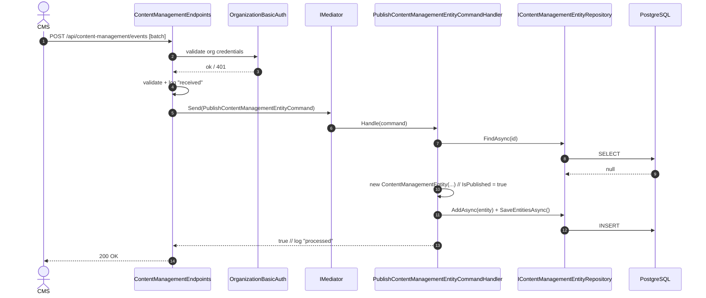
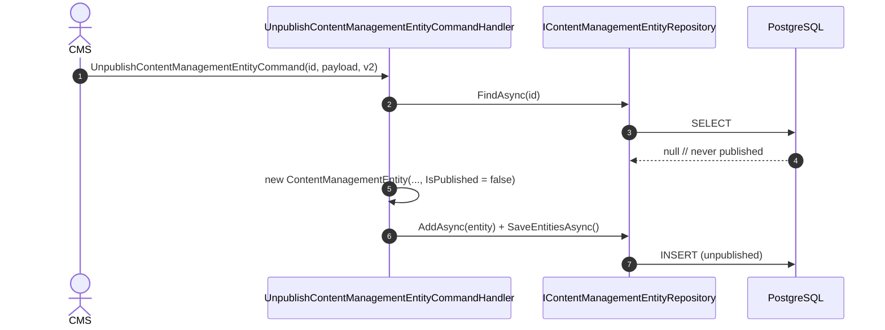
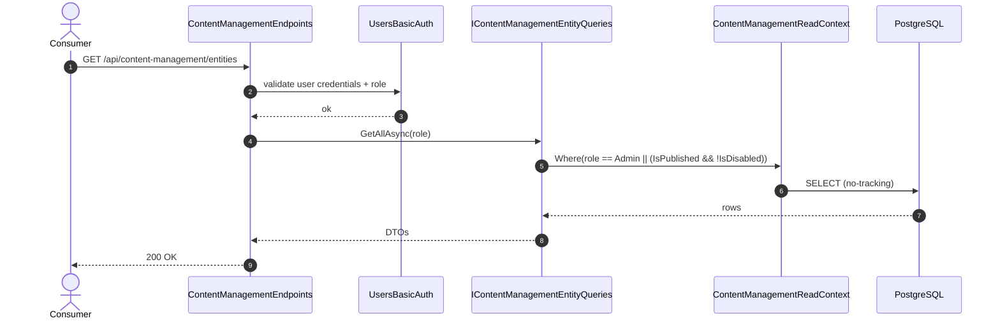
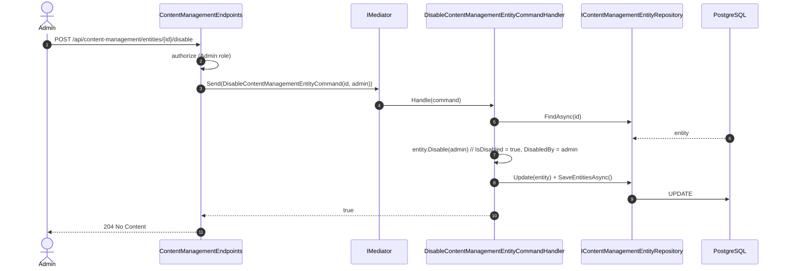

# Sequence Diagrams

## Ingest a publish event

```mermaid
sequenceDiagram
  autonumber
  actor CMS
  participant API as ContentManagementEndpoints
  participant Auth as OrganizationBasicAuth
  participant M as IMediator
  participant H as PublishContentManagementEntityCommandHandler
  participant R as IContentManagementEntityRepository
  participant DB as PostgreSQL

  CMS->>API: POST /api/content-management/events [batch]
  API->>Auth: validate org credentials
  Auth-->>API: ok / 401
  API->>API: validate + log "received"
  API->>M: Send(PublishContentManagementEntityCommand)
  M->>H: Handle(command)
  H->>R: FindAsync(id)
  R->>DB: SELECT
  DB-->>R: null
  H->>H: new ContentManagementEntity(...)  // IsPublished = true
  H->>R: AddAsync(entity) + SaveEntitiesAsync()
  R->>DB: INSERT
  H-->>API: true  // log "processed"
  API-->>CMS: 200 OK
```

## Unpublish corner case (version never published)

```mermaid
sequenceDiagram
  autonumber
  actor CMS
  participant H as UnpublishContentManagementEntityCommandHandler
  participant R as IContentManagementEntityRepository
  participant DB as PostgreSQL

  CMS->>H: UnpublishContentManagementEntityCommand(id, payload, v2)
  H->>R: FindAsync(id)
  R->>DB: SELECT
  DB-->>R: null  // never published
  H->>H: new ContentManagementEntity(..., IsPublished = false)
  H->>R: AddAsync(entity) + SaveEntitiesAsync()
  R->>DB: INSERT (unpublished)
```

## Read entities (role-filtered, read-only context)

```mermaid
sequenceDiagram
  autonumber
  actor U as Consumer
  participant API as ContentManagementEndpoints
  participant Auth as UsersBasicAuth
  participant Q as IContentManagementEntityQueries
  participant RC as ContentManagementReadContext
  participant DB as PostgreSQL

  U->>API: GET /api/content-management/entities
  API->>Auth: validate user credentials + role
  Auth-->>API: ok
  API->>Q: GetAllAsync(role)
  Q->>RC: Where(role == Admin || (IsPublished && !IsDisabled))
  RC->>DB: SELECT (no-tracking)
  DB-->>Q: rows
  Q-->>API: DTOs
  API-->>U: 200 OK
```

## Admin disable (local override)

```mermaid
sequenceDiagram
  autonumber
  actor A as Admin
  participant API as ContentManagementEndpoints
  participant M as IMediator
  participant H as DisableContentManagementEntityCommandHandler
  participant R as IContentManagementEntityRepository
  participant DB as PostgreSQL

  A->>API: POST /api/content-management/entities/{id}/disable
  API->>API: authorize (Admin role)
  API->>M: Send(DisableContentManagementEntityCommand(id, admin))
  M->>H: Handle(command)
  H->>R: FindAsync(id)
  DB-->>R: entity
  H->>H: entity.Disable(admin)  // IsDisabled = true, DisabledBy = admin
  H->>R: Update(entity) + SaveEntitiesAsync()
  R->>DB: UPDATE
  H-->>API: true
  API-->>A: 204 No Content
```
